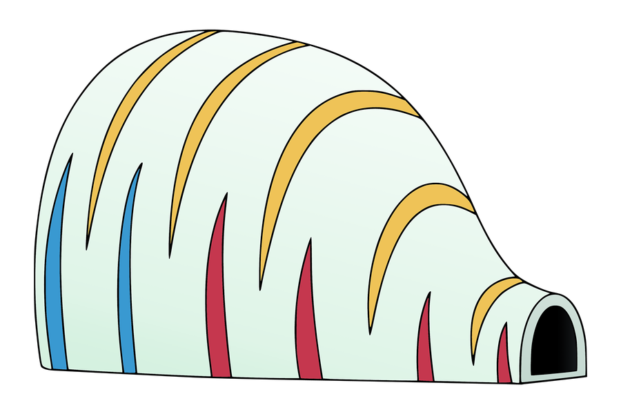

# Gulliver Tunnel

<p align="center">
  
</p>

Gulliver Tunnel shrinks all the images in a folder, including every sub-folder, to fit a size you choose. Like the Gulliver Tunnel gadget from Doraemon, it only makes things smaller.

## What it does

- It shrinks images to fit your size and never makes them bigger.
- It can crop images to fill your size exactly.
- It keeps the same folder structure as the original folder.
- It leaves your original images untouched.
- It never overwrites your own files. When you run it again, it replaces its earlier results instead of making copies.
- It removes hidden information, such as location, camera details and dates.
- It saves images as JPG or PNG.

## Install

Gulliver Tunnel needs Python 3.9 or later. You install it with pipx, which keeps it separate from the rest of your system.

### Step 1: Install pipx

You only need to do this once.

On macOS, run:

```sh
brew install pipx
pipx ensurepath
```

On Windows, run:

```sh
py -m pip install --user pipx
py -m pipx ensurepath
```

### Step 2: Install Gulliver Tunnel

Open a new terminal window and run:

```sh
pipx install https://github.com/wernjien/gulliver-tunnel/archive/refs/heads/main.zip
```

The `gulliver` command is now ready to use.

To update to the newest version later, run:

```sh
pipx install --force https://github.com/wernjien/gulliver-tunnel/archive/refs/heads/main.zip
```

## Quick start

To shrink every image in your Holiday folder to fit within 1920×1080 pixels, run:

```sh
gulliver ~/Desktop/Holiday -w 1920 -h 1080
```

The results are saved in a Holiday folder inside your Pictures folder, with the same sub-folders as the originals:

```text
Original                     Result
~/Desktop/Holiday/           ~/Pictures/Holiday/
├── beach.png                ├── beach.jpg
└── day1/                    └── day1/
    └── sunset.heic              └── sunset.jpg
```

## Choosing the size

Use `-w` to set the maximum width and `-h` to set the maximum height, in pixels. You can give one of them or both. If you give neither, both are 2000.

**Width and height.** Each image shrinks until it fits inside both limits, and its shape never changes. If the image's shape is different from your limits, the side that needs more shrinking sets the size. For example, a 4000×3000 image becomes 1440×1080, not 1920×1440.

```sh
gulliver ~/Desktop/Holiday -w 1920 -h 1080
```

**Width only.** The width shrinks to your limit, and the height follows the image's shape. For example, a 4000×3000 image becomes 1200×900.

```sh
gulliver ~/Desktop/Holiday -w 1200
```

**Height only.** The height shrinks to your limit, and the width follows the image's shape. For example, a 4000×3000 image becomes 1067×800.

```sh
gulliver ~/Desktop/Holiday -h 800
```

Images that are already smaller than your limits keep their original size. Photos taken sideways on a phone are turned upright before they are shrunk.

## Cropping to fill the size

By default, nothing is cut off, so an image can end up narrower or shorter than your limits. To fill your size instead, choose one of these crop options. Each one needs both `-w` and `-h`. If you give neither, the size is 2000×2000. The crop always keeps the middle of the image and cuts the same amount from both edges.

**Crop to fill.** Use `--crop` to fill your size exactly. Each image shrinks until it covers both limits, and the part that sticks out is cut off. For example, a 4000×3000 image shrinks to 1920×1440, and then 180 pixels are cut from the top and from the bottom, which gives 1920×1080.

```sh
gulliver ~/Desktop/Holiday -w 1920 -h 1080 --crop
```

**Crop only the width.** Use `--crop-width` to cut off the left and right, but never the top and bottom. Each image shrinks to your height, and if it is still wider than your width, the sides are cut off. For example, a 6000×2000 image becomes 1920×1080. A 4000×3000 image becomes 1440×1080 with nothing cut off, because it is already narrow enough.

```sh
gulliver ~/Desktop/Holiday -w 1920 -h 1080 --crop-width
```

**Crop only the height.** Use `--crop-height` to cut off the top and bottom, but never the left and right. Each image shrinks to your width, and if it is still taller than your height, the top and bottom are cut off. For example, a 3000×4000 image becomes 1920×1080. A 6000×2000 image becomes 1920×640 with nothing cut off, because it is already short enough.

```sh
gulliver ~/Desktop/Holiday -w 1920 -h 1080 --crop-height
```

Cropping never makes images bigger either. If an image is smaller than your size, it is only cut, not enlarged. For example, with `--crop`, a 2000×800 image becomes 1920×800.

## Choosing the format

JPG is the default. The quality is 95 unless you change it with `-q`, which takes a number from 1 to 100. A higher number gives better quality and bigger files. JPG can't store transparency, so transparent areas become white.

```sh
gulliver ~/Desktop/Holiday -w 1920 -h 1080 -q 80
```

Use `-f png` to save as PNG instead. PNG keeps transparent areas transparent.

```sh
gulliver ~/Desktop/Logos -w 512 -h 512 -f png
```

## Choosing where to save

By default, the results go into a folder with the same name as your input folder, inside your Pictures folder. For example, `~/Desktop/Holiday` is saved to `~/Pictures/Holiday`. On macOS, the Pictures folder is `~/Pictures`. On Windows, it is your Pictures folder, even if it has been moved to OneDrive.

Use `-o` to use a different folder instead of Pictures. For example, this command saves the results to `~/Desktop/Small/Holiday`:

```sh
gulliver ~/Desktop/Holiday -w 1920 -h 1080 -o ~/Desktop/Small
```

If your folder is already in your Pictures folder, such as `~/Pictures/Holiday`, the results would go back into that same folder. To keep them apart, Gulliver Tunnel adds "(small)" to the name, so the results go to `~/Pictures/Holiday (small)`.

On Windows, you can shrink the photos on an SD card by giving the drive, such as `E:\`. The results folder is named after the card's label, such as `EOS_DIGITAL`. If the card has no label, it is named after the drive, such as `Drive E`.

```sh
gulliver E:\ -w 1920 -h 1080
```

## All options

| Option | What it does |
| --- | --- |
| `-w WIDTH` | Sets the maximum width in pixels. |
| `-h HEIGHT` | Sets the maximum height in pixels. |
| No `-w` or `-h` | Fits each image within 2000×2000. |
| `--crop` | Fills the whole size and cuts off the parts that stick out. |
| `--crop-width` | Shrinks to the height and cuts off the left and right if the image is too wide. |
| `--crop-height` | Shrinks to the width and cuts off the top and bottom if the image is too tall. |
| `-f jpg` or `-f png` | Chooses the format. The default is JPG. |
| `-q QUALITY` | Sets the JPG quality from 1 to 100. The default is 95. |
| `-o FOLDER` | Uses this folder instead of your Pictures folder. The results go into a folder with the input folder's name inside it. |
| `-j JOBS` | Sets how many images are processed at the same time. The default is one for each CPU core, but at most one for every 2 GB of memory. A lower number, such as `-j 2`, keeps your computer more responsive and uses less memory. |
| `--help` | Shows all options. |

## Good to know

- **File names.** Each image keeps its name and gets the extension of the new format. If two images end up with the same name, such as `a.png` and `a.gif`, a number is added to the second one, such as `a (1).jpg`.
- **Running again.** When you run Gulliver Tunnel again on the same folder, it replaces the results it saved before, so you don't get copies. It keeps a hidden list of these results in the results folder. Files that Gulliver Tunnel didn't make are never replaced. If one of them has the same name as a result, a number is added to the result instead, such as `photo (1).jpg`.
- **Hidden information.** Gulliver Tunnel removes location (GPS), camera details, dates, comments and colour profiles. It converts the colours first, so photos from iPhones and other devices still look right.
- **Supported images.** Gulliver Tunnel reads JPG, PNG, GIF, BMP, TIFF, WebP, ICO, PSD, AVIF and HEIC/HEIF (iPhone photos). For animated images and files with several pages, only the first frame is used.
- **Skipped files.** Hidden files such as `.DS_Store` are skipped, and so are files that are not images. If you save into a folder inside the input folder, that folder is skipped, so earlier results aren't shrunk again.
- **Problems.** If an image can't be read, Gulliver Tunnel shows `FAILED` next to its name and carries on with the rest. If your computer still runs out of memory, Gulliver Tunnel stops and suggests a lower `-j`, such as `-j 2`. Running it again replaces the images that were already saved.
